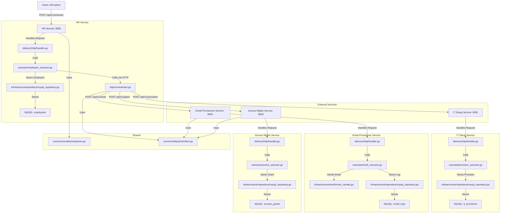

Below, I’ll provide an architecture diagram in Markdown format (using Mermaid syntax for visualization, which is commonly supported in Markdown renderers like GitHub or VS Code) and explain the **file flow**, **design patterns** used, and **how they work** in the Employee Onboarding System. I’ll keep the explanation concise, intuitive, and aligned with the mentor-style tone, focusing on the flow of data and interactions between files and services.

---

## Architecture Diagram

Here’s the architecture diagram in Markdown using Mermaid syntax. You can render this in tools like GitHub, GitLab, or VS Code with Mermaid plugins to visualize the microservices and their interactions.

**How to View the Diagram**:
- Copy the Mermaid code into a Markdown file (e.g., `architecture.md`).
- Use a Mermaid-compatible viewer like GitHub, GitLab, or a VS Code extension (e.g., “Markdown Preview Mermaid Support”).
- The diagram shows:
  - The **HR Service** as the orchestrator, receiving client requests and calling other services.
  - **IT Setup**, **Email Provisioner**, and **Access Rights** services handling their respective tasks.
  - MySQL databases for each service storing data.
  - Shared `common` package for the `Employee` model and HTTP client.

---

## File Flow Explanation

The **file flow** describes how data moves through the system when an HR admin triggers an onboarding request. I’ll trace the flow from the client request to the final database updates, highlighting how files interact across services.

### **Scenario: Onboarding a New Employee**
An HR admin sends a POST request to `/api/v1/onboard` with employee details (e.g., `{"name": "Alice", "email": "alice@example.com", "address": "123 Main St", "role": "Dev"}`).

#### **Step 1: HR Service Entry Point**
- **File**: `hr-service/cmd/server/main.go`
  - **Role**: Initializes the HR Service server, loads environment variables (e.g., `DB_DSN`, `IT_URL`), and sets up the Gin router with the `/onboard` endpoint.
  - **Flow**: The client’s HTTP request hits the Gin router, which routes it to `delivery/http/handler.go`.
  - **Connections**: Wires up the `EmployeeHandler`, `EmployeeUsecase`, and `EmployeeRepository`.

#### **Step 2: Handling the HTTP Request**
- **File**: `hr-service/delivery/http/handler.go`
  - **Role**: The `Onboard` method binds the JSON request to a `domain.OnboardingRequest` (defined in `hr-service/domain/employee.go`, which uses `common/models/employee.go`).
  - **Flow**: Validates the request, then calls `usecase.EmployeeUsecase.Onboard`.
  - **Connections**: Uses `domain.Employee` and `usecase/employee_usecase.go`.

#### **Step 3: Business Logic & Orchestration**
- **File**: `hr-service/usecase/employee_usecase.go`
  - **Role**: The `Onboard` method:
    1. Saves the employee to the database via `repository.EmployeeRepository.Save`.
    2. Orchestrates calls to IT, Email, and Access Rights services via `infrastructure/http/orchestrator.go`.
  - **Flow**:
    - Calls `infrastructure/repository/mysql_repository.go` to save the employee to the `employees` table.
    - Uses `httpclient.Client` (from `common/httpclient/client.go`) to send HTTP POST requests to:
      - IT Service (`/api/v1/provision`).
      - Email Service (`/api/v1/send`).
      - Access Rights Service (`/api/v1/grant`).
  - **Connections**: Depends on `repository/mysql_repository.go`, `http/orchestrator.go`, and `common/httpclient/client.go`.

#### **Step 4: Database Storage in HR Service**
- **File**: `hr-service/infrastructure/repository/mysql_repository.go`
  - **Role**: Executes an SQL `INSERT` to save the employee data (`name`, `email`, `address`, `role`) in the `employees` table and returns the new `ID`.
  - **Flow**: Returns the saved `Employee` struct to `usecase/employee_usecase.go`.
  - **Connections**: Implements `repository/interface.go`.

#### **Step 5: IT Setup Service**
- **Files**:
  - `it-setup-service/cmd/server/main.go`: Receives the `/provision` request, routes it to `delivery/http/handler.go`.
  - `it-setup-service/delivery/http/handler.go`: Binds the JSON request to `domain.ProvisionRequest` (from `domain/provision.go`) and calls `usecase.ProvisionUsecase.Provision`.
  - `it-setup-service/usecase/provision_usecase.go`: Creates a `Provision` struct (hardcoding `Device: "Laptop"`, `Status: "Provisioned"`) and saves it via `repository.ProvisionRepository.Save`.
  - `it-setup-service/infrastructure/repository/mysql_repository.go`: Inserts the provision data into the `it_provisions` table.
- **Flow**: The HR Service’s HTTP call triggers the IT Service to log a device provisioning record for the employee.
- **Connections**: Uses `domain/provision.go` and `repository/interface.go`.

#### **Step 6: Email Provisioner Service**
- **Files**:
  - `email-provisioner-service/cmd/server/main.go`: Receives the `/send` request, routes it to `delivery/http/handler.go`.
  - `email-provisioner-service/delivery/http/handler.go`: Binds the JSON request to `domain.SendRequest` (from `domain/email.go`) and calls `usecase.EmailUsecase.Send`.
  - `email-provisioner-service/usecase/email_usecase.go`: Calls the mock sender (`infrastructure/email/mock_sender.go`) to simulate sending an email, then saves a log via `repository.EmailRepository.Save`.
  - `email-provisioner-service/infrastructure/repository/mysql_repository.go`: Inserts the email log into the `email_logs` table.
- **Flow**: The HR Service’s HTTP call triggers the Email Service to simulate sending a welcome email and log it.
- **Connections**: Uses `domain/email.go`, `infrastructure/email/interface.go`, and `repository/interface.go`.

#### **Step 7: Access Rights Service**
- **Files**:
  - `access-rights-service/cmd/server/main.go`: Receives the `/grant` request, routes it to `delivery/http/handler.go`.
  - `access-rights-service/delivery/http/handler.go`: Binds the JSON request to `domain.GrantRequest` (from `domain/access.go`) and calls `usecase.AccessUsecase.Grant`.
  - `access-rights-service/usecase/access_usecase.go`: Creates an `AccessGrant` struct (hardcoding `Permissions: ["read", "write"]`) and saves it via `repository.AccessRepository.Save`.
  - `access-rights-service/infrastructure/repository/mysql_repository.go`: Inserts the access grant into the `access_grants` table (storing permissions as JSON).
- **Flow**: The HR Service’s HTTP call triggers the Access Rights Service to grant permissions and log them.
- **Connections**: Uses `domain/access.go` and `repository/interface.go`.

#### **Step 8: Response Back to Client**
- **File**: `hr-service/delivery/http/handler.go`
  - **Role**: Returns the saved `Employee` as a JSON response (HTTP 201 Created) to the HR admin.
  - **Flow**: The onboarding process completes, and the client receives confirmation.

### **Summary of File Flow**
1. **Client → HR Service** (`main.go` → `handler.go` → `usecase.go`):
   - The HR Service receives the onboarding request, validates it, and processes business logic.
2. **HR Service → Database** (`usecase.go` → `repository.go`):
   - Saves the employee to the `employees` table.
3. **HR Service → Other Services** (`usecase.go` → `orchestrator.go` → `httpclient.go`):
   - Sends HTTP requests to IT, Email, and Access Rights services.
4. **IT/Email/Access Services** (`main.go` → `handler.go` → `usecase.go` → `repository.go`):
   - Each service processes its task (provision device, send email, grant permissions) and saves data to its respective MySQL table (`it_provisions`, `email_logs`, `access_grants`).
5. **Response**:
   - The HR Service returns the employee data to the client.

---

## Design Patterns Used

The Employee Onboarding System employs several design patterns to ensure modularity, testability, and maintainability. Here’s a breakdown of the key patterns and how they work:

1. **Clean Architecture**:
   - **What**: The system separates concerns into layers: **Domain** (data models), **Usecase** (business logic), **Repository** (data access), and **Delivery** (HTTP handling).
   - **How It Works**:
     - **Domain**: Defines structs like `Employee`, `Provision`, `EmailLog`, and `AccessGrant` to represent core entities (e.g., `hr-service/domain/employee.go`).
     - **Usecase**: Encapsulates business logic (e.g., `hr-service/usecase/employee_usecase.go` orchestrates onboarding).
     - **Repository**: Abstracts database access (e.g., `hr-service/infrastructure/repository/mysql_repository.go`).
     - **Delivery**: Handles HTTP requests (e.g., `hr-service/delivery/http/handler.go`).
     - Each layer depends only on the layer below it, ensuring loose coupling.
   - **Why**: Makes the code modular, testable, and independent of external systems (e.g., you can swap MySQL for PostgreSQL without changing usecases).

2. **Repository Pattern**:
   - **What**: Abstracts data access logic using interfaces (e.g., `hr-service/repository/interface.go`, `it-setup-service/repository/interface.go`).
   - **How It Works**:
     - Each service defines a repository interface (e.g., `EmployeeRepository`, `ProvisionRepository`) with methods like `Save` or `FindByID`.
     - Concrete implementations (e.g., `mysql_repository.go`) handle MySQL operations.
     - Usecases depend on the interface, not the implementation, allowing easy swapping of data sources.
   - **Why**: Enables testability (mocks can implement the interface) and decouples business logic from database details.

3. **Orchestrator Pattern**:
   - **What**: The HR Service coordinates multiple services (IT, Email, Access) via HTTP calls (in `hr-service/infrastructure/http/orchestrator.go`).
   - **How It Works**:
     - The `employeeUsecase.Onboard` method calls `CallITProvision`, `CallEmailSend`, and `CallAccessGrant` to trigger actions in other services.
     - Uses `httpclient.Client` to send HTTP requests, ensuring a single point of orchestration.
   - **Why**: Centralizes coordination logic, making it easier to manage dependencies and handle failures.

4. **Dependency Injection**:
   - **What**: Dependencies (e.g., repositories, HTTP clients) are passed to components rather than hardcoded.
   - **How It Works**:
     - In `hr-service/cmd/server/main.go`, the `EmployeeUsecase` is created with a repository and HTTP clients.
     - Similarly, each service’s `main.go` injects dependencies into usecases and handlers.
   - **Why**: Improves testability (mocks can be injected) and flexibility (dependencies can be swapped).

5. **Adapter Pattern**:
   - **What**: The `common/httpclient/client.go` abstracts HTTP communication.
   - **How It Works**:
     - Provides a `Client` struct with a `Post` method to send JSON requests to other services.
     - Used by `hr-service/infrastructure/http/orchestrator.go` to call external services.
   - **Why**: Simplifies HTTP communication and allows swapping HTTP clients (e.g., for custom timeouts or retry logic).

6. **Mock Pattern**:
   - **What**: Used in testing (e.g., `email-provisioner-service/infrastructure/email/mock_sender.go`) and placeholder mocks in test files.
   - **How It Works**:
     - The `MockSender` simulates email sending for testing.
     - Test files (e.g., `hr-service/hr_test.go`, `it-setup-service/it_test.go`) use placeholder mocks for repositories and clients.
   - **Why**: Allows testing without relying on external systems (e.g., real email providers or databases).

7. **Domain-Driven Design (DDD)**:
   - **What**: Domain models (e.g., `Employee`, `Provision`, `EmailLog`) are defined in `domain` packages to represent core business entities.
   - **How It Works**:
     - Each service has a `domain` package (e.g., `hr-service/domain/employee.go`) defining structs for requests and responses.
     - The shared `common/models/employee.go` ensures consistency across services.
   - **Why**: Aligns the code with business concepts, making it easier to reason about the system.

---

## How the Design Patterns Work Together

- **Clean Architecture** organizes the codebase into layers, ensuring that business logic (`usecase`) is isolated from HTTP handling (`delivery`) and database access (`repository`).
- **Repository Pattern** and **Dependency Injection** make each layer testable and flexible. For example, `hr-service/usecase/employee_usecase.go` depends on the `EmployeeRepository` interface, not the MySQL implementation, allowing mocks for testing (as seen in `hr_test.go`).
- **Orchestrator Pattern** in `hr-service` coordinates the microservices, using the **Adapter Pattern** (`httpclient`) to communicate reliably.
- **Mock Pattern** supports unit testing by simulating external dependencies (e.g., email sending).
- **DDD** ensures that the code reflects the business domain (onboarding, provisioning, permissions), making it intuitive for developers and stakeholders.

### **Example Workflow with Patterns**
When an onboarding request is made:
1. **Clean Architecture**: The request flows from `handler.go` (Delivery) to `usecase.go` (Usecase) to `repository.go` (Repository) in the HR Service.
2. **Orchestrator Pattern**: The `usecase.go` calls `orchestrator.go` to coordinate with other services.
3. **Adapter Pattern**: The `httpclient` sends HTTP requests to IT, Email, and Access services.
4. **Repository Pattern**: Each service saves its data (e.g., `it_provisions`, `email_logs`) using its repository.
5. **DDD**: The `Employee`, `Provision`, and `AccessGrant` structs ensure data consistency across services.

---

## Understanding for a Junior Developer

Imagine the Employee Onboarding System as a factory assembly line:
- **HR Service** is the factory manager, receiving orders (onboarding requests) and directing workers (other services).
- **IT Setup**, **Email Provisioner**, and **Access Rights** services are specialized workers, each handling one task (device, email, permissions).
- **Clean Architecture** is like organizing the factory into departments (design, production, storage) to keep things orderly.
- **Repository Pattern** is the storage room, hiding how items are stored (e.g., shelves or boxes) so workers only need to know what to store.
- **Orchestrator Pattern** is the manager’s checklist, ensuring every worker completes their task.
- **Dependency Injection** is like handing workers the right tools (e.g., a database connection) instead of making them find their own.
- **DDD** ensures the factory’s products (data models) match what the customer (business) expects.

The **file flow** is like a conveyor belt: the request starts at the HR Service, moves through its layers (handler → usecase → repository), branches out to other services via HTTP, and each service processes its task independently, storing results in its own database.

---

## Possible Improvements to Patterns
- **Add Saga Pattern**: For distributed transactions, use a saga (e.g., via a message queue like RabbitMQ) to handle failures (e.g., rollback if one service fails).
- **Circuit Breaker**: Add a circuit breaker in `httpclient` to handle repeated failures from external services.
- **Factory Pattern**: Introduce a factory for creating HTTP clients with different configurations (e.g., timeouts, retries).
- **Event-Driven Architecture**: Replace HTTP calls with events (e.g., publish “EmployeeOnboarded” to a queue) for better decoupling.

---

This explanation should give you a clear picture of how the system’s files interact, the design patterns in play, and how they enable a modular, scalable onboarding process. Let me know if you’d like to dive deeper into any specific pattern or file! 🚀